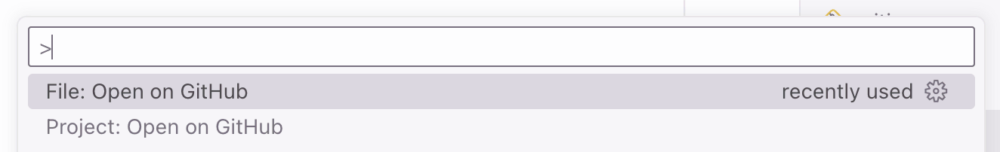

  

<h1 align="center">Reveal on GitHub</h1>

Open current project or file on GitHub website.

## Commands

You can either run this commands from the Command Palette (<kbd>Cmd</kbd>+<kbd>Shift</kbd>+<kbd>P</kbd> on a Mac, or <kbd>Ctrl</kbd>+<kbd>Shift</kbd>+<kbd>P</kbd> on Windows), or [assign hotkeys](https://code.visualstudio.com/docs/configure/keybindings).

| Command                    | Description                        |
| -------------------------- | ---------------------------------- |
| `openOnGitHub.openProject` | Open current project on GitHub     |
| `openOnGitHub.openFile`    | Open currently open file on GitHub |

## Changelog

The changelog can be found on the [Releases](https://github.com/nicksp/vscode-open-on-github/releases) page.

## Contributing

Bug fixes are welcome, but not new features. Read our [contributing guidelines](CONTRIBUTING.md) to learn more.

[Open an issue](https://github.com/nicksp/vscode-open-on-github/issues) on GitHub and [submit a pull request](https://github.com/nicksp/vscode-open-on-github/pulls).

## Authors and License

[Nick Plekhanov](https://plekhanov.me) and [contributors](https://github.com/nicksp/vscode-open-on-github/graphs/contributors).

[MIT License](LICENSE.md).
